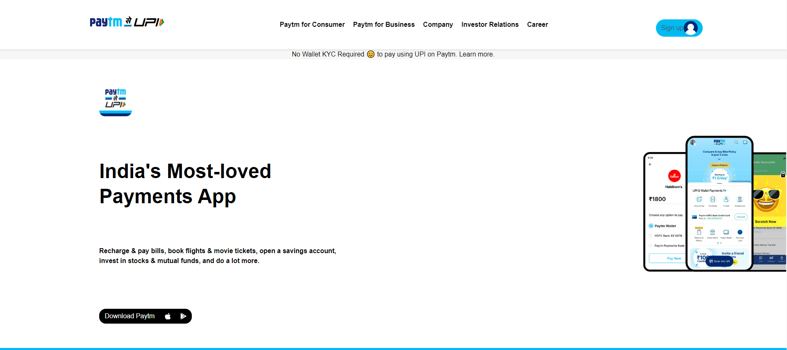

### This project is made my using HTML and tailwind css

# Experience

> This project made me feel I much I have to learn more so it start at aug 15 and 3 days to just reading doc and understanding any thing i can
> I made this whole project without any video reference just used doc for tailwind and stack overflow and w3school, This project taught me basic of tailwind css but it also tought me how to do re-search it took me a week to make just becasue I was reading the document most of the time
> (now i don't even open doc's i just use property for tailwind css)

> This project took 7 days with all the documnent understand and
> working

[depolyed link](https://paytm-clone-project.vercel.app/)
